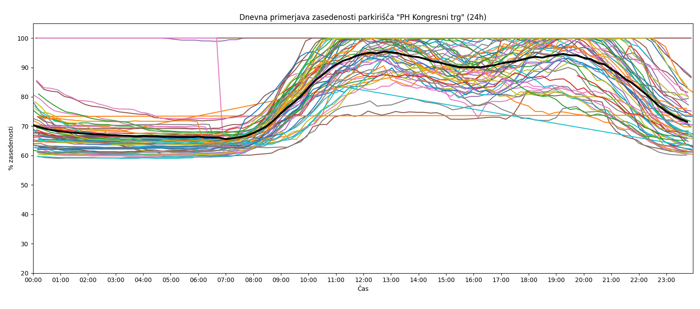
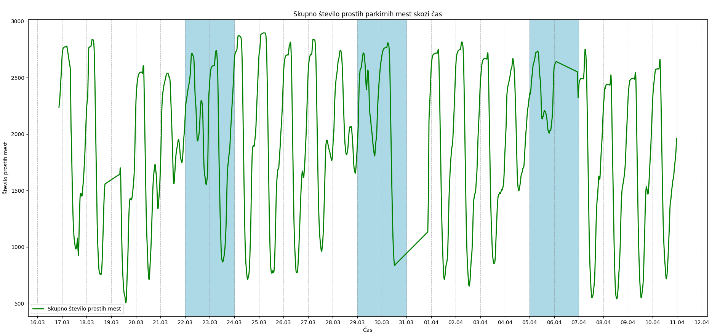
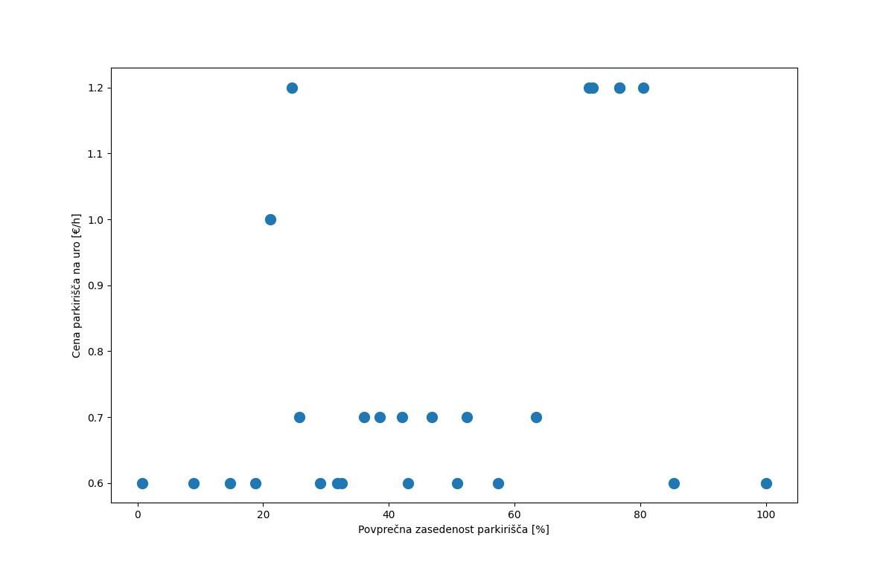
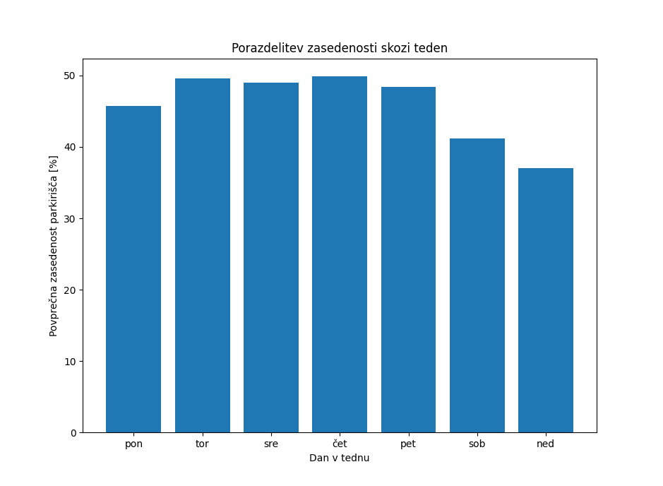
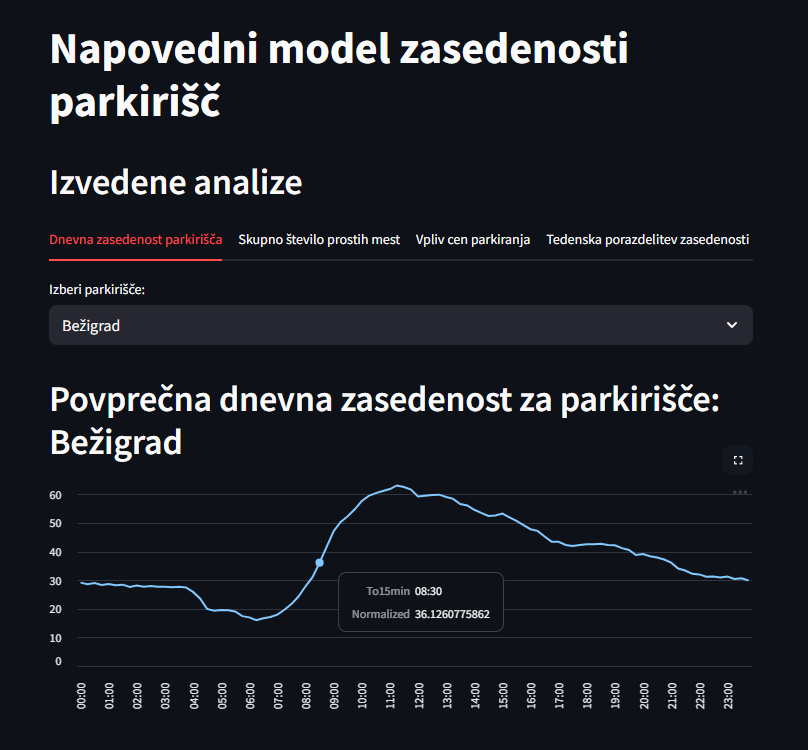
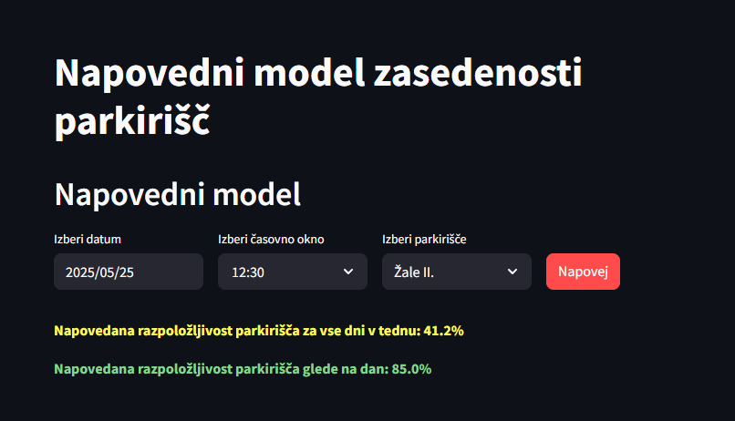

## Statistika parkirišč mestne občine Ljubljana

### Uvod 
V tem projektu nas je zanimalo, kakšna je zasedenost parkirišč v Mestni občini Ljubljana (MOL), saj smo želeli na podlagi podatkov ugotoviti, kdaj imamo največ možnosti za uspešno iskanje parkirnega mesta.

### O podatkih
Naredili smo "web-scraperja", ki vsakih 15 minut pridobi podatke s spletne strani [mestne občine ljubljana](https://www.lpt.si/parkirisca/informacije-za-parkiranje/prikaz-zasedenosti-parkirisc),
podatke smo shranjevali v .csv datoteko.

Zajeti podatki vključujejo:

- ime parkirišča,
- status (odprto/zaprto),
- število prostih mest,
- skupno število mest,
- datum in čas zajema.

Poleg tega smo imeli na voljo še pdf datoteko Cenik, v katerem so shranjeni podatki o tarifah za posamezno parkirišče.
Za zajem podatkov smo uporabili knjižnico BeautifulSoup.
Do pisanja tega vmesnega poročila smo uspeli zbrati že precej podatkov. Zajem smo začeli 18. 3. 2025, podatki pa segajo do 30. 5. 2025.

Preden smo začeli podatke uporabljati smo ugotovili da jih za nekaj parkirišč na spletni strani ni zapisano mesto prostih in na voljo, ampak je namesto tega pisalo le "/". Tudi o nekaterih drugih parkiriščih je spletna stran pisala le status zasedenosti brez številskih podatkov, zato smo vrstice za ta parkirišča odstranili.
Poleg tega smo med potekom naloge ugotovili da so ob nekatrih časih zapisane nelogične vrednosti - število prostih mest je bilo večje od števila vseh parkirnih mest. To smo popravili tako, da smo število prostih mest zgoraj omejili z številom parkirišč.
Kot popravek za končno poročilo, smo pri nekaterih analizah popravili časovne okvirje podatkov, ki so sedaj zaokroženi na 15 minutne intervale.

### Ugotovitve:

#### Kongresni trg
Na spodnjem grafu je prikazana zasedenost parkirne hiše na Kongresnem trgu med 18. 3. 2025 in 30. 5. 2025. Vsaka obarvana krivulja predstavlja en dan, črna krivulja pa je povprečje vseh dni.

Na grafu je razvidno, da zasedenost nikoli ne pade pod 60 %. Po podatkih s spletne strani [PH Kongresni trg](https://www.lpt.si/parkirisca/lokacije-in-opis-parkirisc/parkirisca-za-osebna-vozila/ph-kongresni-trg):
V parkirni hiši je mogoče najeti parkirno mesto, vendar največ 400 parkirnih mest. Do najema parkirnega mesta so upravičeni stanovalci in pravne osebe...
je v tej parkirni hiši mogoče najeti največ 400 parkirnih mest. Zato je razmeroma stalna visoka zasedenost pričakovana.

Opazimo tudi, da so nekatere krivulje bistveno pod povprečjem – ob primerjavi z datumi ugotovimo, da gre večinoma za vikende. Ker se na Kongresnem trgu pogosto odvijajo prireditve, 
opažamo lokalne vrhove zasedenosti okoli 12. do 13. ure ter ponovno okoli 20. ure – to je čas, ko obiskovalci prihajajo na dogodke.

#### Gospodarsko rastavišče
Spodaj je prikazana zasedenost parkirišča pri Gospodarskem razstavišču v obdobju od 18. 3. 2025 do 30. 5. 2025. Vsaka barvna krivulja predstavlja en dan, odebeljena črna krivulja pa povprečje.

Na grafu je razvidno, da do 7. ure zjutraj ni nobenega zabeleženega parkiranega avtomobila. Po preverjanju na strani [Gospodarsko rastavišče](https://www.lpt.si/parkirisca/lokacije-in-opis-parkirisc/parkirisca-za-osebna-vozila/gospodarsko-razstavisce) 
smo ugotovili, da se parkirišče odpre šele po sedmi uri, kar potrjuje ujemanje z našimi podatki.
Kar se sklada z našimi podatki.
Tudi tukaj je razlika med delovniki in vikendi očitna. 
Poleg tega proti večeru vidimo marsikater primer, kjer se pojavi nenaden vzpon zasedenosti parkirišča. Glede na to, da so bili podatki zajeti v času maturantskih plesov, je možno, da večerna povečana zasedenost (po 18:30) sovpada s temi dogodki.

#### Skupno število prostih parkirnih mest skozi čas
Spodnji graf prikazuje skupno število prostih mest skozi vse dni beleženja. Modro ozadje označuje vikende.

Opazimo, da je največ prostih parkirnih mest zgodaj zjutraj, medtem ko je okoli poldneva dosežena najvišja zasedenost.

#### Vpliv cene parkiranja na zasedenost parkirišča

Na grafu spodaj je na y-osi prikazana cena za 1 uro parkiranja, na x-osi pa povprečna zasedenost parkirišča (v odstotkih) skozi vse dni beleženja.

Iz grafa lahko razberemo, da kljub nizki ceni parkiranja zasedenost na mnogih parkiriščih ni visoka.
V spodnjem desnem delu grafa se pojavi nenavaden primer – eno parkirišče je ves čas prikazano kot polno. To skoraj zagotovo kaže na napako v podatkih (verjetno težava s senzorjem).
V zgornjem desnem delu se pojavi skupina parkirišč z visoko ceno in hkrati visoko zasedenostjo – med njimi sta tudi Sanatorij Emona in Metelkova ulica, ki sta znani in dobro obiskani lokaciji.
Na tej podlagi sklepamo, da ima na zasedenost večji vpliv lokacija, ne pa nujno cena parkiranja.

#### Porazdelitev zasedenosti skozi teden
Na grafu je prikazana povprečna zasedenost po dnevih v tednu za celotno zajeto obdobje.

Kot pričakovano so vikendi – še posebej nedelje – najmanj zasedeni dnevi v tednu. Parkirišča pa so najbolj polna ob četrtkih
Pri teh podatkih pa bodimo pozorni, da je to celodnevno povprečje.
Stopnja zasedenosti  bi bila precej višja če bi upoštevali le časovni interval od 7:00-19:00 ko so parkirišča najbolj polna, kar lahko vidimo že iz iz 1. in 2. slike, ki predstavljata zasedenost parkirišč skozi čas.

### Streamlit

Našo seminarsko nalogo smo v Streamlit-u realizirali v tri glavne zavihke: Predstavitev, kjer predstavimo seminarsko nalogo; Analiza, kjer smo implementirali vse naše analize iz vmesne predstavitve ter jih naredili interaktivno vpogledujoče za naše predrage uporabnike; ter Napoved, kjer smo ustvarili napovedni model, ki glede na vnešene podatke uporabnikov, vrne na zaslon napovedano razpoložljivost izbranega parkirnega mesta, glede na vse dni v tednu ter tudi specifično na določen dan v tednu.

[Aplikacijo si lahko v živo ogledate tukaj](https://pr2519.streamlit.app/)

