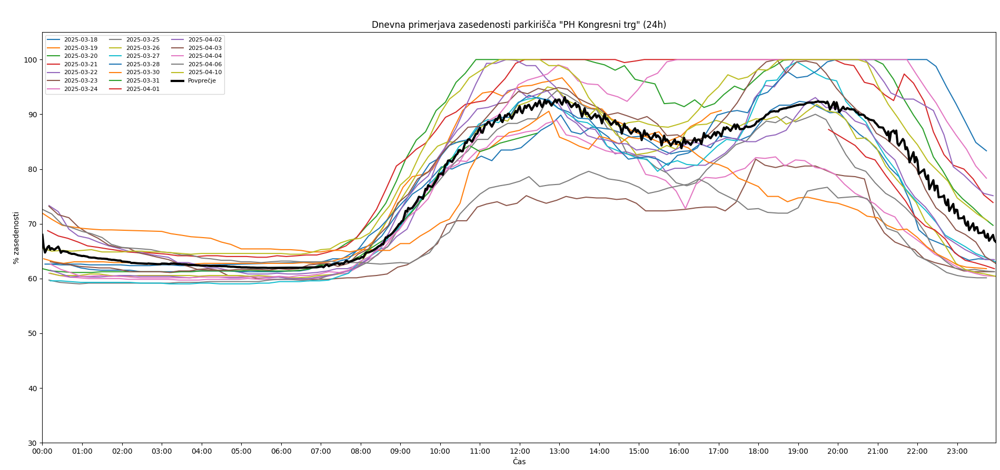
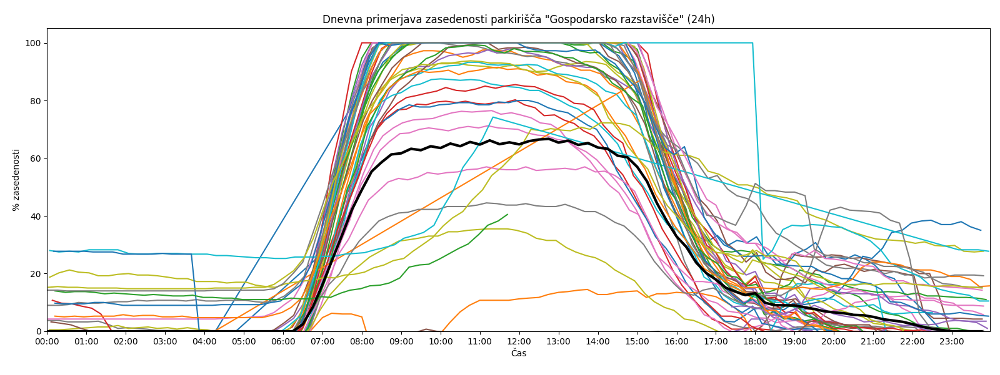
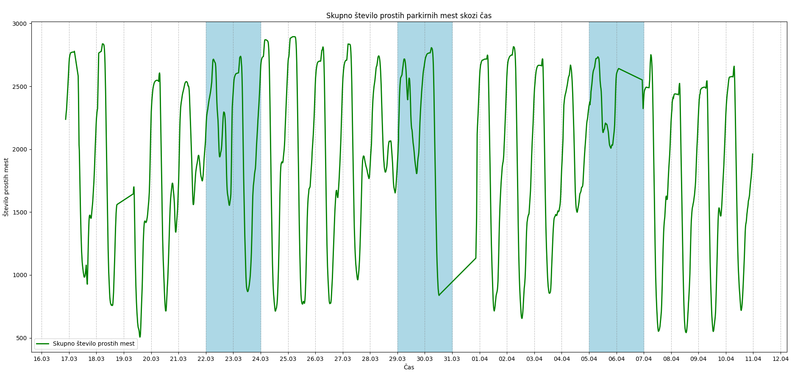
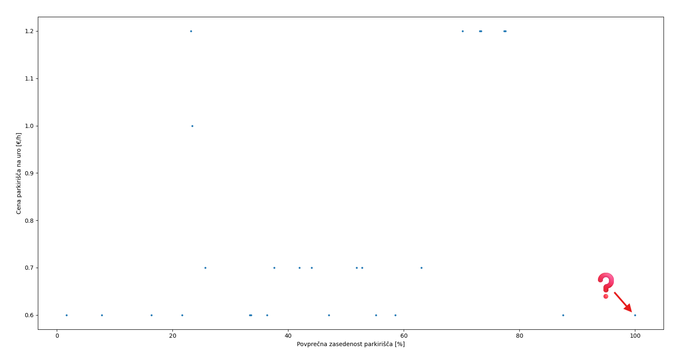
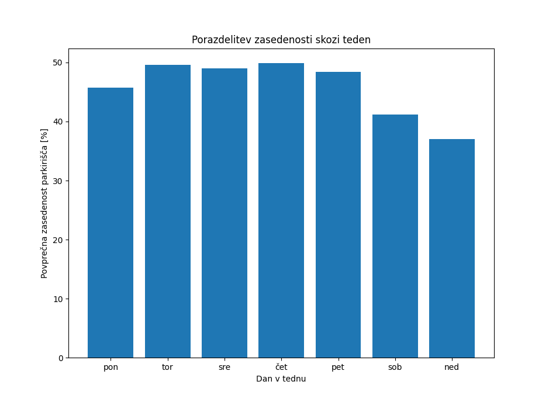

## STATISTIKA PARKIRIŠČ MESTNE OBČINE LJUBLJANA

### Uvod 
V tem projektu nas je zanimalo, kakšna je zasedenost parkirišč v Mestni občini Ljubljana (MOL), saj smo želeli na podlagi podatkov ugotoviti, kdaj imamo največ možnosti za uspešno iskanje parkirnega mesta.

### O podatkih
Naredili smo "web-scraperja", ki vsakih 15 minut pridobi podatke s spletne strani [mestne občine ljubljana](https://www.lpt.si/parkirisca/informacije-za-parkiranje/prikaz-zasedenosti-parkirisc),
podatke smo shranjevali v .csv datoteko.

Zajeti podatki vključujejo:

- ime parkirišča,
- status (odprto/zaprto),
- število prostih mest,
- skupno število mest,
- datum in čas zajema.

Za zajem podatkov smo uporabili knjižnico BeautifulSoup.
Do pisanja tega vmesnega poročila smo uspeli zbrati že precej podatkov. Zajem smo začeli 18. 3. 2025, podatki pa segajo do 10. 4. 2025.

### Ugotovitve:

#### Kongresni trg
Na spodnjem grafu je prikazana zasedenost parkirne hiše na Kongresnem trgu med 18. 3. 2025 in 10. 4. 2025. Vsaka obarvana krivulja predstavlja en dan, črna krivulja pa je povprečje vseh dni.

Na grafu je razvidno, da zasedenost nikoli ne pade pod 60 %. Po podatkih s spletne strani [PH Kongresni trg](https://www.lpt.si/parkirisca/lokacije-in-opis-parkirisc/parkirisca-za-osebna-vozila/ph-kongresni-trg):
V parkirni hiši je mogoče najeti parkirno mesto, vendar največ 400 parkirnih mest. Do najema parkirnega mesta so upravičeni stanovalci in pravne osebe...
je v tej parkirni hiši mogoče najeti največ 400 parkirnih mest. Zato je razmeroma stalna visoka zasedenost pričakovana.

Opazimo tudi, da so nekatere krivulje bistveno pod povprečjem – ob primerjavi z datumi ugotovimo, da gre večinoma za vikende. Ker se na Kongresnem trgu pogosto odvijajo prireditve, 
opažamo lokalne vrhove zasedenosti okoli 12. do 13. ure ter ponovno okoli 20. ure – to je čas, ko obiskovalci prihajajo na dogodke.

#### Gospodarsko rastavišče
Spodaj je prikazana zasedenost parkirišča pri Gospodarskem razstavišču v obdobju od 18. 3. 2025 do 10. 4. 2025. Vsaka barvna krivulja predstavlja en dan, črna pa povprečje.

Na grafu je razvidno, da do 7. ure zjutraj ni veliko podatkov. Po preverjanju na strani [Gospodarsko rastavišče](https://www.lpt.si/parkirisca/lokacije-in-opis-parkirisc/parkirisca-za-osebna-vozila/gospodarsko-razstavisce) 
smo ugotovili, da se parkirišče odpre šele po sedmi uri, kar potrjuje ujemanje z našimi podatki.
Kar se sklada z našimi podatki.
Tudi tukaj je razlika med delovniki in vikendi očitna. Glede na to, da so bili podatki zajeti v času maturantskih plesov, je možno, da večerna povečana zasedenost (po 18:30) sovpada s temi dogodki.

#### Skupno število prostih parkirnih mest skozi čas
Spodnji graf prikazuje skupno število prostih mest skozi vse dni beleženja. Modro ozadje označuje vikende.

Opazimo, da je največ prostih parkirnih mest zgodaj zjutraj, medtem ko je okoli poldneva dosežena najvišja zasedenost.

#### Vpliv cene parkiranja na zasedenost parkirišča

Na grafu spodaj je na y-osi prikazana cena za 1 uro parkiranja, na x-osi pa povprečna zasedenost parkirišča (v odstotkih) skozi vse dni beleženja.

Iz grafa lahko razberemo, da kljub nizki ceni parkiranja zasedenost na mnogih parkiriščih ni visoka.
V spodnjem desnem delu grafa se pojavi nenavaden primer – eno parkirišče je ves čas prikazano kot polno. To skoraj zagotovo kaže na napako v podatkih (verjetno težava s senzorjem).
V zgornjem desnem delu se pojavi skupina parkirišč z visoko ceno in hkrati visoko zasedenostjo – med njimi sta tudi Sanatorij Emona in Metelkova ulica, ki sta znani in dobro obiskani lokaciji.
Na tej podlagi sklepamo, da ima na zasedenost večji vpliv lokacija, ne pa nujno cena parkiranja.

#### Porazdelitev zasedenosti skozi teden
Na grafu je prikazana povprečna zasedenost po dnevih v tednu za celotno zajeto obdobje.

Kot pričakovano so vikendi – še posebej nedelje – najmanj zasedeni dnevi v tednu.

